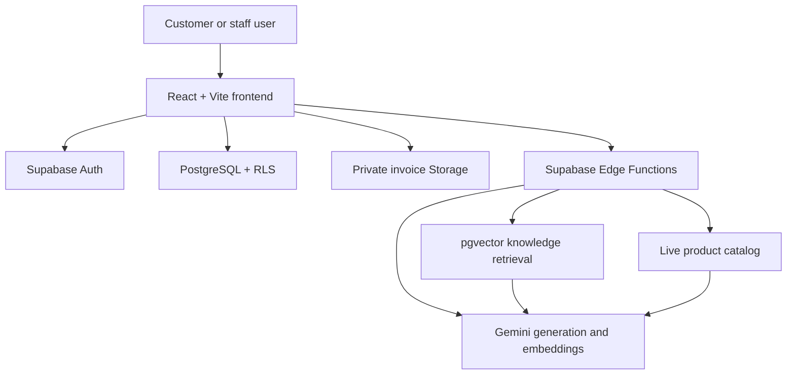

# Charms Hub AI

Charms Hub AI is an AI-powered ecommerce platform that combines real commerce
workflows with a grounded AI shopping and financial-awareness assistant.

## 1. Overview

Charms Hub is a jewelry and accessories storefront with product browsing,
cart and checkout flows, customer accounts, order history, invoices, and
owner/developer operations. Its AI assistant connects verified business
knowledge and live catalog records to Gemini through a Supabase Edge Function.

The assistant uses retrieval-augmented generation (RAG) so that product prices,
availability, payment guidance, policies, and other business answers come from
approved knowledge records or current database data instead of unsupported
model assumptions. When verified information is unavailable, the assistant
returns an explicit limitation rather than inventing an answer.

## 2. Key Features

### Customer

- Supabase Auth registration, email confirmation, login, logout, and password reset
- Product browsing, search, categories, and product details
- Cart and checkout
- Transactional order creation
- Customer order history and account management
- Historical invoice PDF generation
- Private invoice download and five-minute signed invoice links
- Invoice sharing through native sharing or clipboard fallback
- Order timeline and cancellation flow

### Commerce

- Database-side order creation and authoritative pricing
- Stock and active-product validation
- Configurable shipping calculation
- Immutable order-item snapshots
- Order status events and server-enforced status transitions
- Idempotent order creation support
- Cancellation handling
- `Refund Required` state for applicable prepaid cancellations requiring manual review
- UPI and Cash on Delivery flows
- Explicit pending-verification handling for UPI payments

### AI Assistant

- Gemini-powered grounded response generation
- Supabase Edge Function RAG pipeline
- 768-dimensional Gemini embeddings and pgvector similarity retrieval
- Verified `knowledge_base` records
- Live product, price, stock, and availability grounding
- Payment, cancellation, refund-state, and policy grounding
- Unsupported-information fallback:
  `I don't have verified information about that.`
- Retrieval-only degradation when Gemini generation is unavailable

### Security

- Supabase Auth with database-backed user profiles and roles
- Customer, shop-owner, and developer authorization
- PostgreSQL Row Level Security (RLS)
- Private invoice Storage bucket
- Deterministic invoice object paths
- Five-minute signed invoice URLs
- Gemini credentials stored only in Supabase Edge Function secrets
- Owner/developer access controls enforced by database policies

## 3. AI / RAG Architecture

```text
React frontend
      |
      v
Supabase Edge Function: chat-with-rag
      |
      +--> Query embedding through Gemini
      |
      +--> pgvector similarity search
      |        |
      |        v
      |   Verified knowledge_base records
      |
      +--> Current product/catalog records
      |
      v
Verified context passed to Gemini
      |
      v
Grounded response or verified retrieval-only response
```

The generation layer is Gemini. The business source of truth is the verified
knowledge base and the live PostgreSQL catalog. Product answers use current
active product records, while business answers use active knowledge records
with indexed 768-dimensional embeddings. The retrieval RPC applies a default
similarity threshold of `0.72`.

The Edge Function instructs Gemini to use only supplied context and rejects
unsupported numeric claims before returning generated text. If generation or
embedding is unavailable, the system falls back to verified retrieved content
or the unsupported-information response. Gemini credentials never reach the
browser.

## 4. Technology Stack

### Frontend

- React
- TypeScript
- Vite
- Tailwind CSS
- React Router
- Lucide React
- jsPDF for invoice PDF rendering

### Backend and cloud

- Supabase
- PostgreSQL
- Supabase Auth
- Supabase Storage
- Supabase Edge Functions

### AI and retrieval

- Gemini generation and embeddings through the Gemini REST API
- pgvector
- Retrieval-augmented generation (RAG)
- Verified business knowledge records

## 5. Architecture



The browser uses only the public Supabase client configuration. Database
ownership, role authorization, invoice access, and knowledge visibility are
enforced by RLS and server-side database functions. Gemini secrets are
available only to Edge Functions.

## 6. Database / Security

Supabase Auth provides the authenticated identity and persistent session.
Database profiles assign the least-privileged `customer` role by default;
owner and developer roles are managed through the server-side authorization
model.

RLS protects:

- user profiles
- products and categories
- orders and order items
- invoices
- activity logs
- store configuration
- knowledge records
- order events

Customer orders, order items, invoices, and order events are restricted to the
authenticated customer's own records. Shop owners and developers receive only
the elevated access explicitly defined by existing policies and services.

The `invoices` Storage bucket is private. Customer invoice objects use the
deterministic path:

```text
<authenticated-user-id>/<invoice-id>.pdf
```

Customer Storage policies require both the authenticated user folder and a
matching owned invoice record. Invoice access is provided through short-lived
signed URLs rather than public URLs.

## 7. Order and Invoice Flow

```text
Cart
  -> Checkout
  -> authoritative create_order transaction
  -> order record
  -> order_items snapshot records
  -> invoice record
  -> private invoice PDF
  -> five-minute signed URL
```

The database transaction computes authoritative monetary values and stores
historical item snapshots. Invoice rendering uses those stored snapshot fields,
including product name, quantity, unit price, line total, shipping, and order
totals. Existing invoice files are reused at their deterministic path.

Changing current catalog data should not rewrite an already-created invoice,
because the invoice is based on the historical order and invoice snapshot.

## 8. AI Grounding

The assistant handles:

- financial-awareness questions only when verified knowledge is available
- payment and UPI questions using the verified payment records
- cancellation and refund-state questions using the verified policy
- product price and availability using the live active catalog
- unsupported questions with an explicit verified-information fallback
- delivery timelines from verified shipping information

Courier tracking is currently **not available through the Charms Hub system**.
The assistant must not fabricate a tracking link, delivery status, refund
completion, payment confirmation, or other unsupported business claim.

## 9. Environment Variables / Secrets

Copy the example file to a local ignored environment file and configure only
the public frontend Supabase values:

```text
VITE_SUPABASE_URL=https://<your-project-ref>.supabase.co
VITE_SUPABASE_ANON_KEY=<your-public-anon-key>
```

`GEMINI_API_KEY` must not be placed in frontend environment files. Configure it
through Supabase Edge Function secret management:

```text
npx supabase secrets set GEMINI_API_KEY=<key>
```

Never commit API keys, service-role credentials, database passwords, SMTP
credentials, or private tokens.

## 10. Local Development

Prerequisite: Node.js and npm.

```bash
npm install
npm run dev
npm run lint
npm run build
```

The development server runs on port `3000` and binds to `0.0.0.0` according
to `package.json`.

## 11. Supabase Setup

Link the local project using the Supabase CLI, then inspect migration status:

```bash
npx supabase migration list
npx supabase db push --dry-run
npx supabase db push
```

Use secure database authentication when the CLI requests the PostgreSQL
password. Do not place that password in source control. Normal setup should
preserve migration history; destructive database reset is not part of the
project setup workflow.

Relevant Edge Functions are:

- `chat-with-rag`
- `embed-knowledge`
- `ai-status`

## 12. Deployment

The frontend is a Vite-built static application and can be deployed to
Vercel or another suitable frontend host. Supabase provides the hosted
PostgreSQL database, Auth, Storage, and Edge Functions.

No automated deployment workflow is assumed by this repository. Deployments
should be performed through the selected hosting provider and Supabase CLI or
dashboard using their secure configuration mechanisms.

## 13. Project Structure

```text
src/
├── components/
│   ├── Cart/
│   ├── Chatbot/
│   ├── Footer/
│   ├── Header/
│   ├── OrderTimeline/
│   ├── OwnerKnowledge/
│   └── ...
├── context/
│   ├── AuthContext.tsx
│   ├── CartContext.tsx
│   └── ThemeContext.tsx
├── data/
│   ├── categories.ts
│   ├── knowledgeBase.ts
│   ├── productImageMap.ts
│   └── verifiedProducts.ts
├── pages/
│   ├── Account/
│   ├── Auth/
│   ├── Cart/
│   ├── Developer/
│   ├── Policy/
│   ├── ShopOwner/
│   └── ...
├── services/
│   ├── activityLogger.ts
│   ├── chatbot.ts
│   ├── invoiceGenerator.ts
│   ├── knowledgeService.ts
│   ├── orderService.ts
│   ├── storeCatalog.ts
│   ├── storeConfig.ts
│   └── supabase.ts
├── types/
│   └── index.ts
├── App.tsx
└── main.tsx

supabase/
├── functions/
│   ├── ai-status/
│   ├── chat-with-rag/
│   └── embed-knowledge/
└── migrations/
```

## 14. Security Notes

- Never commit secrets.
- Never expose Gemini credentials to the frontend.
- Never use service-role credentials in client code.
- Keep invoice Storage private.
- Preserve RLS and ownership policies.
- Use signed URLs for temporary invoice access.
- Treat database records and verified knowledge as the source of truth.
- Do not fabricate payment, refund, delivery, tracking, contact, or product
  information.
- Use authenticated test accounts for customer and staff workflows.

## 15. Current Limitations

- Courier tracking is not currently available through the Charms Hub system.
- UPI uses manual payment/reference verification rather than a full automated
  payment gateway.
- English, Hindi, and Telugu per-answer translation is not currently
  implemented.
- Linked database lint may require a valid `SUPABASE_DB_PASSWORD` for the
  local CLI.
- Frontend production hosting and deployment automation are not specified by
  this repository.

These are current scope or operational limitations, not claims of unsupported
functionality.

## 16. Review / Demo Flow

1. Sign in with a test account.
2. Browse products and open a product detail page.
3. Add a product to the cart.
4. Complete checkout.
5. Open the account order history.
6. Open, download, and share an invoice.
7. Open the AI assistant.
8. Ask a verified financial or payment question.
9. Ask for a product price or availability result.
10. Ask an unsupported question and verify the honest fallback.
11. Demonstrate authorized owner/developer access with the appropriate role.

## 17. Testing and Validation

The project validation commands are:

```bash
npm run lint
npm run build
npx supabase migration list
```

The current project validation checkpoint includes passing TypeScript/lint and
production build checks, synchronized Supabase migrations, and authenticated
AI/RAG smoke testing covering financial questions, product price and
availability, payment/refund grounding, tracking behavior, unsupported
questions, and response diversity.

## 18. License

License information is not currently specified.
